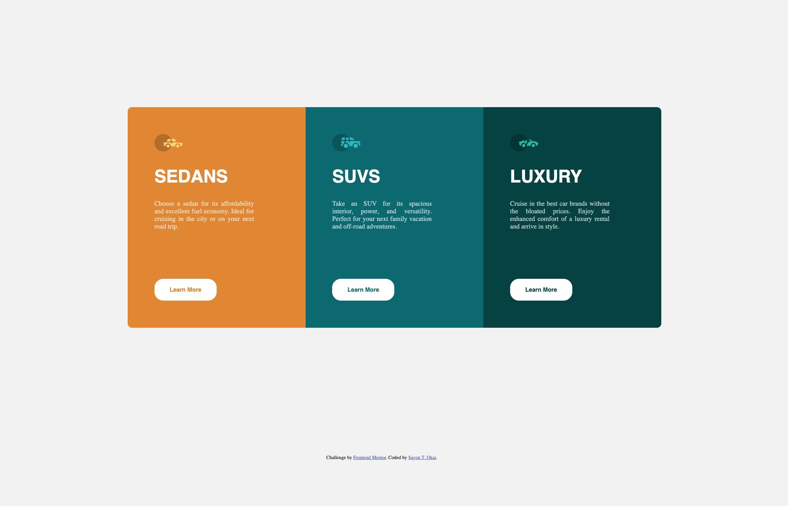

# Frontend Mentor - 3-column preview card component solution

This is a solution to the [3-column preview card component challenge on Frontend Mentor](https://www.frontendmentor.io/challenges/3column-preview-card-component-pH92eAR2-). Frontend Mentor challenges help you improve your coding skills by building realistic projects. 

## Table of contents

- [Overview](#overview)
  - [The challenge](#the-challenge)
  - [Screenshot](#screenshot)
  - [Links](#links)
- [My process](#my-process)
  - [Built with](#built-with)
  - [Continued development](#continued-development)
- [Author](#author)
- [Acknowledgments](#acknowledgments)

## Overview

### The challenge

Users should be able to:

- See hover and focus states for all interactive elements on the page

### Screenshot

### Links

- Solution URL: [https://www.frontendmentor.io/solutions/3columnpreviewcardcomponent-using-css-grid-OWpUyNvTly]
- Live Site URL: [https://sayon-okai.github.io/3-column-preview-card-component-main/]

## My process

### Built with

- Semantic HTML5 markup
- CSS custom properties
- CSS Grid
- CSS Flexbox
- CSS Media Query

### Continued development

- Mobile responsiveness 

## Author

- Website - [Sayon T Okai](https://sayon-okai.github.io/capstone-project2.github.io/)
- Frontend Mentor - [Sayon T Okai](https://www.frontendmentor.io/profile/Sayon-okai)
- GitHub - [Sayon Okai](https://github.com/Sayon-okai)

